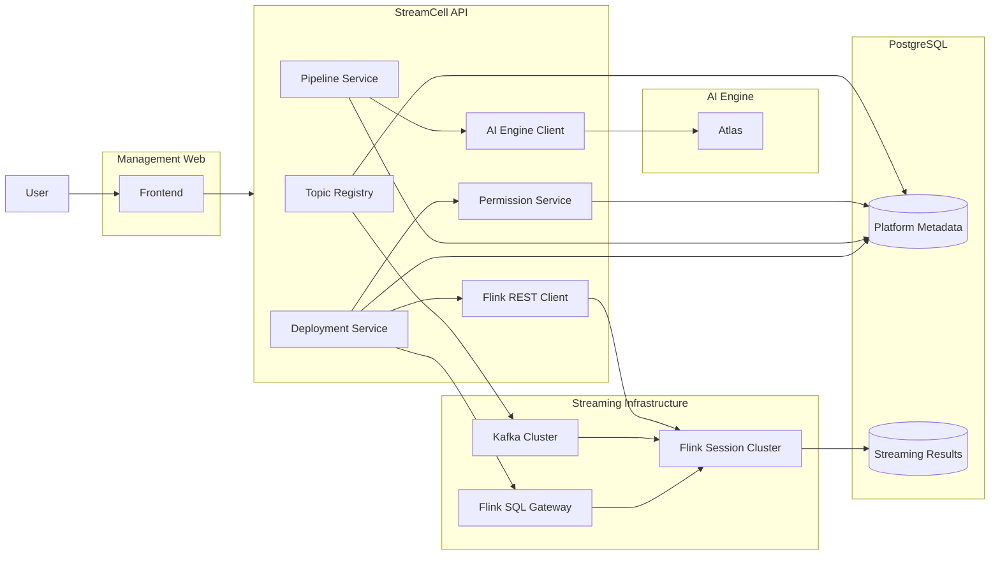

# StreamCell
## 개요
과거에는 실시간 유입 데이터를 분석하거나 모니터링하려면 수집·분석·저장 과정을 주기적 폴링이나 이벤트 등 일관성 없는 방식으로 직접 구현해야 했다.

**StreamCell**은 이 과정을 표준화하여 사용자가 실시간 파이프라인을 다음 단계로 관리할 수 있게 한다.

- 사용자는 StreamCell API Server를 통해 AI로 실시간 파이프라인을 생성(Flink SQL)하거나, 직접 파이프라인 Job을 개발해 배포할 수 있다.
    - 간단한 분석은 AI 에이전트가 Flink SQL로 배포한다.
    - 복잡한 실시간 처리는 개발자가 직접 Flink Job을 개발해 배포한다.

**StreamCell**은 Kafka Topic과 Flink Job을 플랫폼 자원으로 관리하고 사용자의 실시간 스트리밍 파이프라인을 생성/관리하는 플랫폼이다.

## 목표 및 핵심기능
**StreamCell**의 최종목표는 실시간 데이터 분석 또는 예측이 필요한 시스템에서 실시간 데이터 파이프라인을 위한 별도의 시스템을 구축하지 않고 사용자의 실시간 파이프라인 생성/관리를 자동화 하는 것.

- Kafka Topic을 플랫폼에서 조회하고 메타데이터로 관리한다.
- Topic별 메시지 Schema와 이벤트 시간 필드를 관리한다.
- 사용자별 Topic 조회·분석·배포 권한을 제어한다.
- Custom JAR 또는 AI 에이전트를 통해 Flink SQL 으로 Pipeline을 생성한다.
- StreamCell API Server(Spring Boot)를 통해 Flink Job을 배포하고 운영한다.
- Pipeline과 실제 Flink Job의 실행 상태 및 배포 이력을 연결한다.
- Flink 처리 결과와 실패 원인을 사용자가 쉽게 확인할 수 있도록 한다.
- 사용자가 등록한 파이프라인의 **실행, 중지, 상태** 모니터링을 지원한다.
- 사용자는 실시간 처리 결과를 대시보드를 통해 쉽게 결과를 확인할 수 있도록 한다.
  
다음 두 가지 Pipeline 생성 방식을 목표로 한다.

| **Pipeline 유형** | **설명** |
| --- | --- |
| `CUSTOM_JAR` | 사용자가 개발한 Flink Job JAR와 실행 설정을 등록하여 배포 |
| `AI_SQL` | 사용자의 자연어 요청을 분석하여 Flink SQL Pipeline으로 변환 |

## 기술스택

| **구분** | **기술** | **버전** | **사용목적** |
| --- | --- | --- | --- |
| Frontend | React | 18.3 | 프레임워크 |
|  | TypeScript | 5.6 | 언어 |
|  | Vite | 5.4 | Build |
| Backend | Spring Boot | 4.1.0 | Kafka, Flink, Pipeline, Deployment, AI 관리 API |
|  | JDK | 21 | Java Development Kit |
|  | Gradle | 9.5.1 | Build |
| Database | PostgreSQL | 16 | Platform 메타데이터, 스트림 처리결과 저장 |
| Event Broker | Kafka | 4.2.1 | 실시간 Event(데이터) 수집계층 |
| Stream Processing | Flink | 1.19 | 실시간 Event(데이터) 처리계층 |
| AI | Atlas |  | Flink SQL 생성 전용 LLM |

## 아키텍처

## 프로젝트 구조

## 로컬 실행 방법

## 향후 고도화 계획

### Flink
1차 -> Flink Session Cluster 
2차 -> Kubernetes + Flink Kubernetes Operator + Application Mode